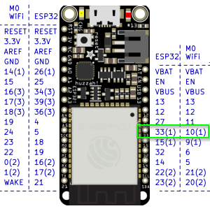

# Digital Input Pin Logging

# Instructions for use
- Wire up an switch between 3V3 and the specified pin 
  - 
- Open the serial monitor with baud 2000000 and toggle the switch observe detected digital pin changes
  - [ToDo: insert image]
- Once recording is started from the `EmotiBit Oscilloscope`, timestamped events with the TypeTag `D0` will be logged to the SD card with other data streams
